# Healthcare Operations Analytics Platform (Cloud Foundation & End-to-End Target State)

Enterprise Azure cloud foundation and end-to-end target state data architecture for a modern **Healthcare Operations Analytics Platform**.

This project demonstrates the design and implementation of a highly secure, governed, and cost-conscious Azure data foundation following modern enterprise cloud and analytics engineering practices. The solution establishes the networking, security, identity governance, and storage layer required to support high-scale, compliance-driven healthcare analytics workloads.

---

# Project Background

**HealthFirst Diagnostics** (fictional) is establishing a secure and scalable Azure data landing zone to support the **Healthcare Operations Analytics Platform**—an enterprise solution designed to ingest batch laboratory operational telemetry, execute data transformations, and serve secure reporting, business intelligence, and advanced analytics.

The long-term platform roadmap centers on a modern **Decoupled Data Lakehouse** pattern using Microsoft Fabric, Azure Data Lake Storage Gen2, Fabric OneLake, Data Factory pipelines, Synapse workloads, and Power BI. This project focuses exclusively on delivering the foundational cloud architecture required to securely host, isolate, and govern those downstream analytics services.

The solution directly follows the Microsoft Cloud Adoption Framework (CAF) and Azure Well-Architected Framework (WAF) to ensure data-plane security and compliance with healthcare data processing standards.

---

# Solution Overview

This repository documents the end-to-end design and implementation of the infrastructure supporting the data lifecycle. 

The implemented solution features:
- **Identity & Governance:** Microsoft Entra ID management and centralized resource governance.
- **Passwordless DevOps Control Plane:** OIDC authentication via GitHub Actions to completely eliminate long-lived repository secrets.
- **Airtight Authorization:** Fine-grained Azure RBAC scoped to the Resource Group level ensuring the principle of least privilege.
- **Network Isolation:** Private connectivity via Azure Private Links and Private DNS Zones to keep data traffic off the public internet.
- **Analytics Storage:** Serverless Azure Data Lake Storage Gen2 (ADLS Gen2) structured into a standardized multi-tier **Medallion Architecture** (Bronze/Silver/Gold).
- **Cost & Data Lifecycle Management:** Tailored retention and automated tiering strategies to minimize cloud expenditure.

---

## Project Scope

### In Scope
- **Secure Network Foundation:** VNet and Private Endpoint configurations for data store isolation.
- **Identity & Access Management:** Provisioning Microsoft Entra ID App Registrations and Service Principals.
- **Automated Trust Handshake:** Configuring Workload Identity Federation (WIF) and OpenID Connect (OIDC) tokens via GitHub Actions.
- **Lakehouse Storage Core:** Designing a custom Medallion directory layout within ADLS Gen2 tailored for scheduled batch extraction.
- **Governance Documentation:** Architectural Decision Logs (ADL), Naming/Tagging standards, and Cost management frameworks.

### Out of Scope (Future Strategy)
- **Active Code Pipelines:** Writing internal database schemas, analytical Spark/Python notebook transformations, or live data ingestion code.
- **SaaS Workspace Configuration:** Click-configuring the Microsoft Fabric portal, assigning capacities, or setting user workspace access policies.
- **Real-Time Data Streams:** High-velocity streaming infrastructure (e.g., Event Hubs, Kafka, Fabric Real-Time Intelligence) as the current platform is optimized for scheduled batch loads.
- **Production Deployment & Large-Scale Infrastructure.**

---

# Current Cloud Foundation Architecture

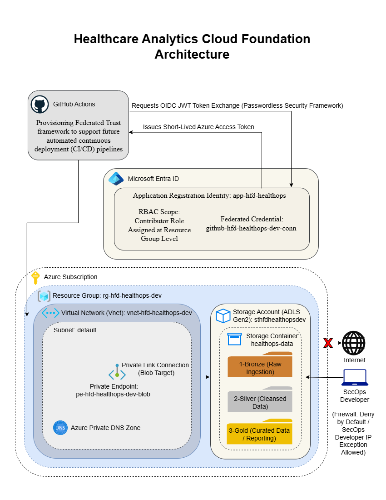

The baseline deployment enforces **Security by Design** at the infrastructure layer:
- **Network Boundary:** Data assets inside ADLS Gen2 are strictly isolated within a private Azure Virtual Network using a "Deny-by-Default" firewall posture.
- **Private Link Tunneling:** Any inbound or outbound traffic traverses a secure **Private Endpoint** mapped to an Azure Private DNS Zone, completely blocking public internet visibility.
- **Data Landing Zone:** ADLS Gen2 is partitioned into storage containers optimized for batch-driven file processing.

---

# Target End-to-End Analytics Architecture

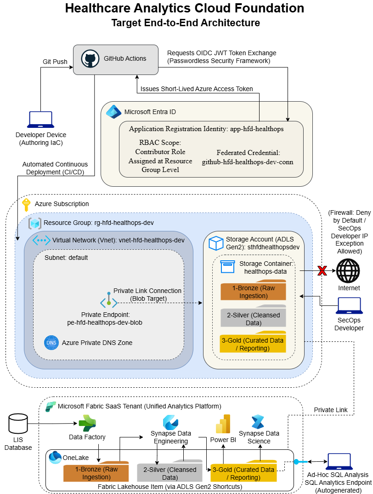

The cloud foundation implemented in this project acts as the secure launchpad for a future target-state **Modern Data Lakehouse Platform**, mapping out the full end-to-end data lifecycle:

- **Ingestion (Data Factory):** Scheduled batch extraction pipelines pulling from operational database sources (like LIS) and dropping raw files directly into the **OneLake ➔ `1-bronze/` shortcut**.
- **Transformation (Synapse Data Engineering):** Apache Spark Notebooks processing and cleaning raw files, graduating them to delta formats in **OneLake ➔ `2-silver/` shortcut**.
- **Relational Modeling (Synapse Data Warehouse):** Materializing curated, business-ready facts and dimensions (Star-Schema modeling) into the **OneLake ➔ `3-gold/` shortcut**.
- **Ad-Hoc SQL Analysis (SQL Analytics Endpoint):** An autogenerated, read-only gateway allowing Enterprise Data Analysts to execute direct, high-performance T-SQL queries against gold tables using standard client tools (SSMS / Azure Data Studio).
- **Executive Visualization (Power BI):** Serving rich analytical reporting dashboards utilizing **Direct Lake Mode** to stream data directly out of OneLake without copying or refreshing underlying datasets.
- **Predictive AI (Synapse Data Science):** A future Phase 2 expansion to train Machine Learning models utilizing curated historical gold data features.

---

# Sprint 0 — Project Initiation & Governance

Focused on setting up project version control architecture, mapping agile timeline milestones, and finalizing corporate alignment documents to ensure the data lakehouse adheres to compliance and budgeting guardrails.

### Key Actions Executed
- Formulated the repository structure on GitHub for clean configuration management.
- Authored the core operational program documents: Project Charter, Solution Architecture Document (SAD), and the Architecture Decision Log (ADL).
- Created the enterprise-wide Naming & Tagging standard to track data asset resource ownership.
- Engineered a Cloud Cost Optimization & Storage Lifecycle Management strategy to forecast and control future operational spend.

### Evidence
- **Version Control Environment:** Public/Private GitHub Project Layout
- **Portfolio Library Framework:** Standardized project scope parameters

*(You can insert your planning/repo images here if desired, or let the text stand as a summary)*

---

# Sprint 1 — Identity Handshake & Workload Identity Federation (WIF)

Focused on initializing local workspace architecture, establishing the central cloud landing zone identity, and configuring the secure, passwordless trust handshake with GitHub Actions to eliminate credential leaks.

### Key Actions Executed
- Initialized local development workspace and version control directory modeling.
- Provisioned a centralized **Microsoft Entra ID App Registration** and corresponding Enterprise Application to serve as the cloud automation workload identity.
- Engineered passwordless authentication using **OpenID Connect (OIDC)** Federated Credentials within Entra ID, linking securely to target GitHub repository branches.
- Developed and verified a `validate-azure-identity.yml` GitHub Actions pipeline workflow to cryptographically test and prove the active cloud authentication handshake.

### Evidence
- **App Registration Profile:** `app-hfd-healthops`
- **OIDC Federated Connection:** `github-hfd-healthops-dev-conn`

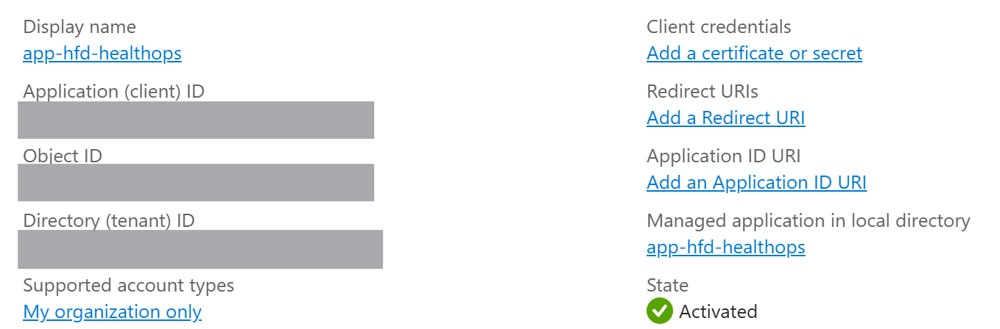

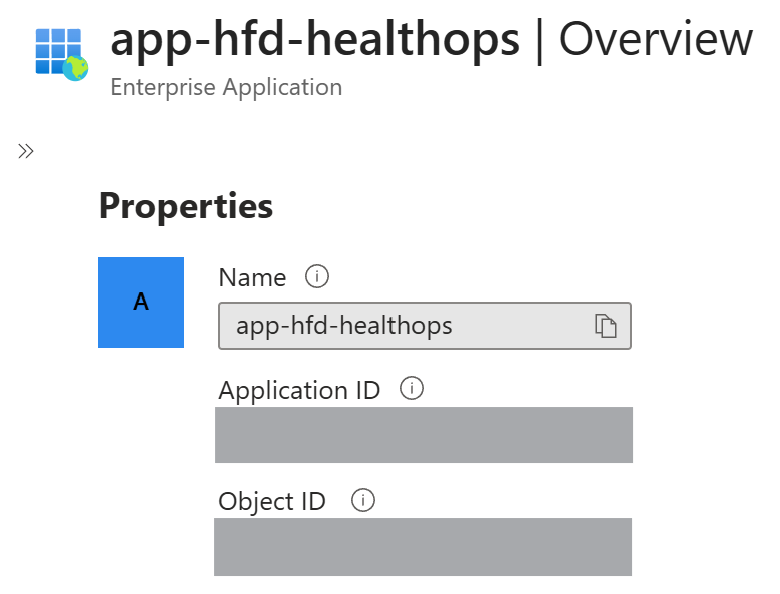

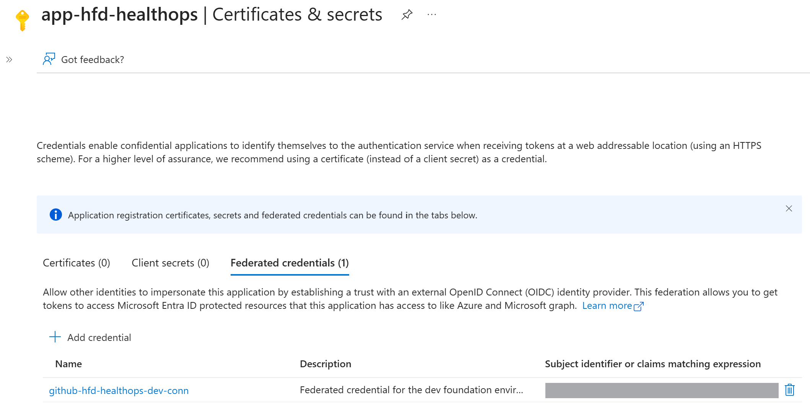

---

# Sprint 2 — Portal Implementation, Medallion Layout, & Secure Networking

Focused on hands-on infrastructure building inside the Azure sandbox boundary, verifying secure network isolation perimeters, constructing the core lakehouse layout, and exporting the active physical environment state.

### Key Actions Executed
- Established the core administrative boundary by deploying the target Azure **Resource Group**.
- Enforced strict least-privilege governance by assigning the Azure **RBAC Contributor role** to the automation Service Principal exclusively at the Resource Group scope.
- Structured an isolated Azure **Virtual Network (VNet)** containing a dedicated, secure subnet block.
- Provisioned a serverless **Azure Data Lake Storage Gen2 (ADLS Gen2)** instance with Hierarchical Namespace (HNS) enabled for high-performance directory querying.
- Formulated a standard **Medallion Architecture directory structure** inside the data container (`/1-bronze` for raw ingestion, `/2-silver` for cleansed schemas, and `/3-gold` for analytics-ready reporting tables) to act as the direct attachment layer for Fabric OneLake shortcuts.
- Wrapped the storage account inside an explicit network firewall configured to **Deny by Default**, shifting public access entirely to a secure **Private Endpoint** mapped to an internal **Azure Private DNS Zone**.
- Generated a verbose **Azure Resource Manager (ARM) JSON blueprint** by exporting the complete active environment layout via the Azure Resource Export engine.

### Evidence
- **Resource Group:** `rg-hfd-healthops-dev`
- **Virtual Network:** `vnet-hfd-healthops-dev`
- **Storage Account:** `sthfdhealthopsdev`
- **Storage Container:** `healthops-data`
- **Private Endpoint:** `pe-hfd-healthops-dev-blob`

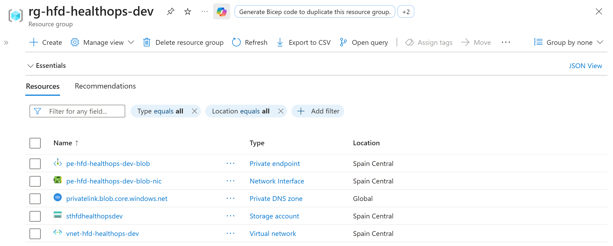

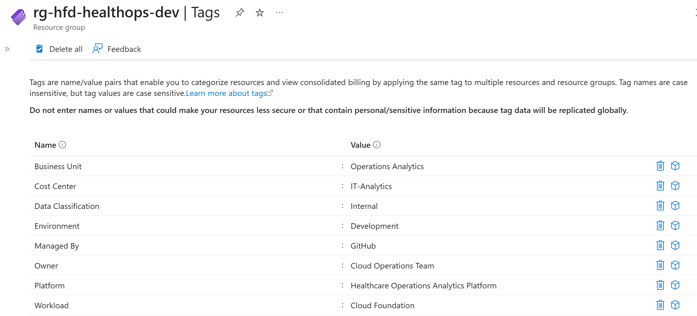

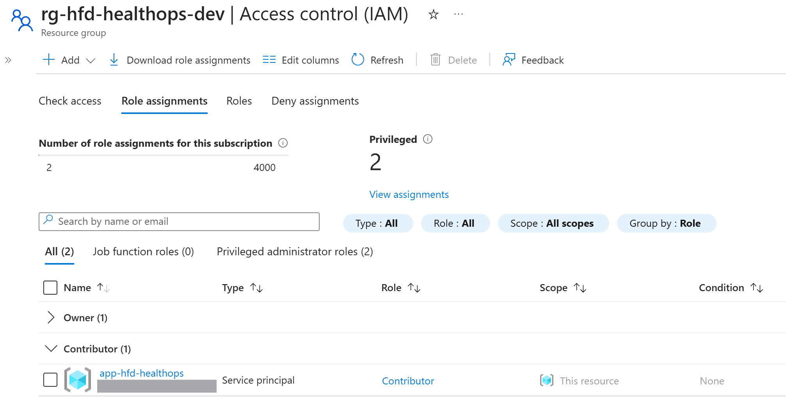

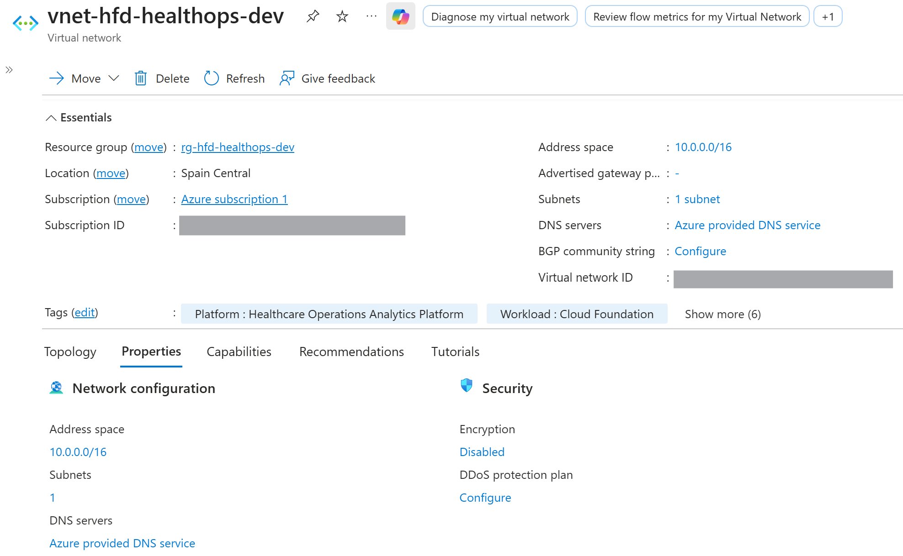

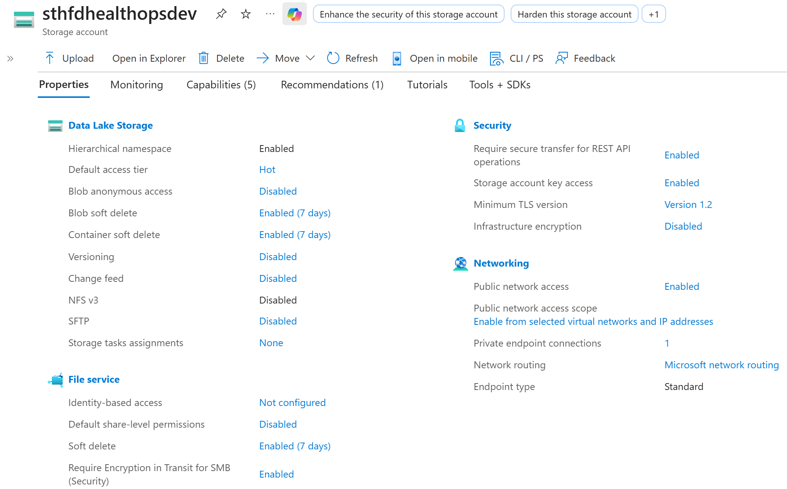

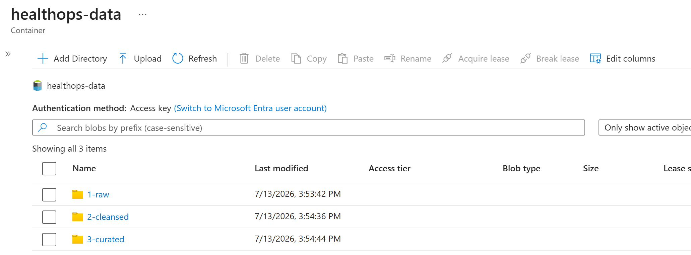

---

# Sprint 3 — Bicep Decompilation, Naming Standardization, & Documentation Polish

Focused on transforming the exported cloud environment blueprint into automated Infrastructure as Code (IaC) configuration scripts, parameterizing deployment properties, and polishing high-level governance deliverables.

### Key Actions Executed
- Reverse-engineered the raw exported ARM JSON script to construct a reusable, fully parameterized **Bicep Infrastructure-as-Code** template asset (`main.bicep`).
- Finalized and integrated core technical program documentation including the Project Charter, Solution Architecture Document (SAD), Architecture Decision Log (ADL), Naming & Tagging Standards, and Cloud Cost Lifecycle Management Framework.

### Evidence
- **Infrastructure Blueprint:** Standardized repository code resource file (`main.bicep`)
- **Project Documentation Portfolio Library:**
  - `project-charter.pdf`
  - `architecture-decision-log.pdf`
  - `solution-architecture-document.pdf`
  - `naming-tagging-standard.pdf`
  - `cost-lifecycle-management.pdf`
  - `sprint-schedule.pdf`

---

# Core Core Technologies

### Cloud Infrastructure & Security
- Microsoft Azure Core Services
- Microsoft Entra ID (Identity Management)
- OpenID Connect (OIDC) & Workload Identity Federation (WIF)
- Azure Virtual Network & Private Link Technology
- Azure Private DNS Zones
- Azure Role-Based Access Control (RBAC)

### Data & Analytics Architecture (Target State)
- Microsoft Fabric & OneLake Architecture
- Azure Data Lake Storage Gen2 (Delta/Parquet storage formats)
- Fabric Data Factory (Scheduled Batch Ingestion)
- Synapse Data Engineering (Spark/Python Data Modeling)
- Synapse Data Warehouse (Relational T-SQL Computing)
- Power BI (Direct Lake Data Ingestion Mode)

---

# Key Architecture Decisions (ADL Summary)

- **Identity Primacy:** Entra ID configuration and automated trust verification established prior to any data resource footprint.
- **Zero-Secret Strategy:** Total elimination of static database or client secrets within the code repository via dynamic OIDC token exchange.
- **Medallion Isolation:** Adopting the decoupled Lakehouse architecture pattern over traditional rigid server-bound relational databases.
- **Boundary Restriction:** Cloud storage network firewalls set to "Deny" to tightly regulate healthcare telemetry streams via explicit private links.

---

# Future Enhancements & Strategic Roadmap

The foundational layer delivers immediate architectural value while providing seamless compatibility for business intelligence scale:
1. **Automation Expansion:** Transitioning the deployment baseline into automated deployment workflows utilizing the finalized Bicep templates.
2. **Workload Activation:** Deploying Fabric Data Factory jobs, setting up Spark schemas, and initializing Power BI semantic models.
3. **Environment Scaling:** Replicating the verified development resource structure into fully isolated QA, Staging, and Production environment subscription boundaries.
